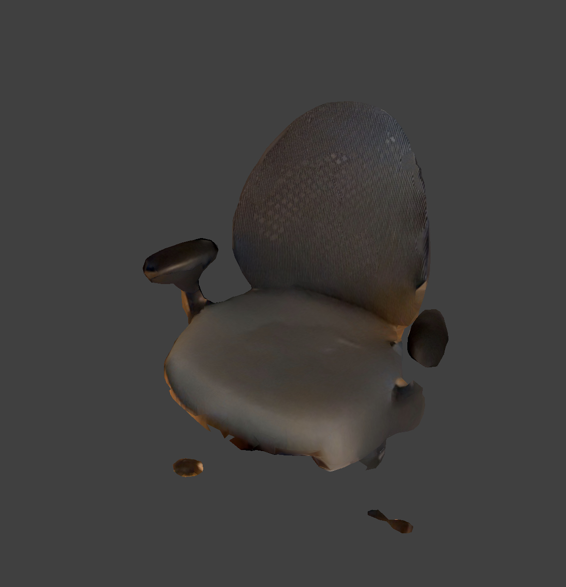

# Varun's User Page

## Table of Contents

- [About Me]()

## About Me

Hello I am Varun! I am a math major at UCSD. Now what is my prgramming style? 

> I smash my forehead into the keyboard and hopefully what I have written works

Okay enough joking around. In all seriousness I don't really know what my coding style is. It is
some blend of careful preperation and randomness but I don't know where it lands. One thing I will say however is that
***VIM*** is the superior text editor. It is much better than

- Emacs
- Any JetBrains editor
- Nano
- VSCode

## Hobbies

Some of my hobbies:

1. Walking
2. Watching Movies
3. Math

Bucket List:

[ ] Make a bucket list

## What I've Written

Since I am a math major I don't have many big coding projects since classes like Math 140B (Real Analysis) take forever. However,
something that I have coded is this [project](https://github.com/ZettabytesCode/PointCloudToVoxelPlugin) which converts 3D
scans like this

Into an object in minecraft (Don't have a picture right now because I can't download minecraft on my Laptop). My favorite line of code that I have 
every written has to be `System.out.println("Hello World");` because that was the first line of code that I wrote.

## About this Repo

This repo is a repo for my user page where the raw contents are stored in [this index file](index.md)
